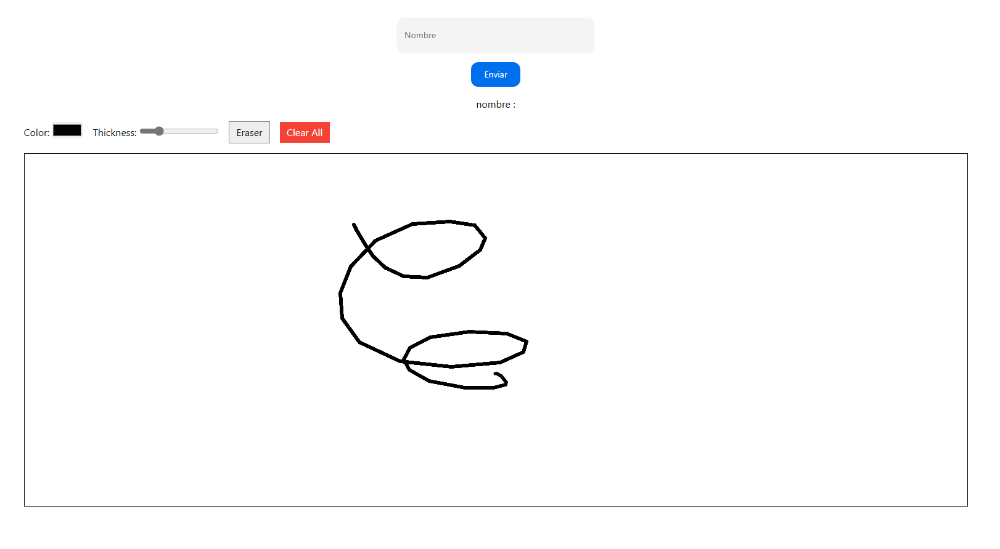

# 🖌️ React PaintBoard + Whiteboard Page

Este proyecto es una aplicación React sencilla que permite al usuario dibujar en una pizarra (`canvas`) con controles de color, grosor, borrador y limpieza. Incluye una entrada de nombre como parte de la interfaz.

---

## 🚀 Características

- Dibujar en canvas con el mouse.
- Cambiar el color del trazo.
- Ajustar el grosor del trazo.
- Alternar entre lápiz y borrador.
- Limpiar toda la pizarra.
- Captura de nombre del usuario.
- Arquitectura basada en componentes reutilizables.

---

---

## ▶️ Uso

### 1. Instalar dependencias

```bash
npm install
```

## 🧠 Requisitos Previos

- React 18+
- TypeScript
- *(Opcional)* Tailwind CSS para estilos

---

## 📷 Vista previa

